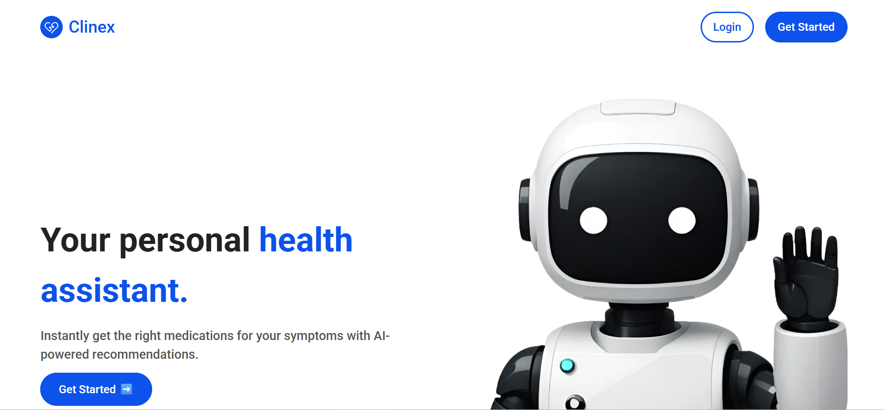
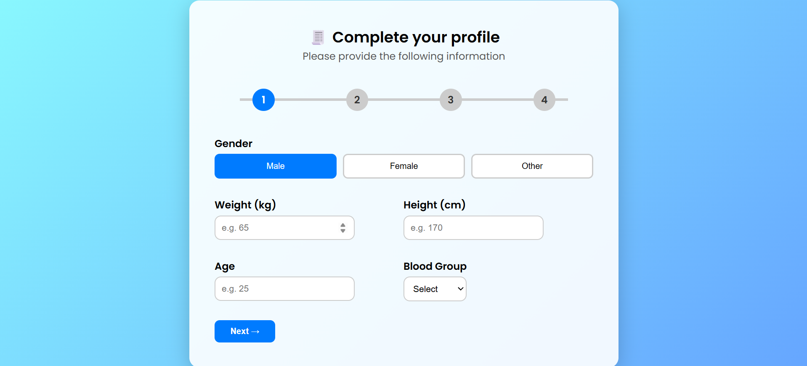
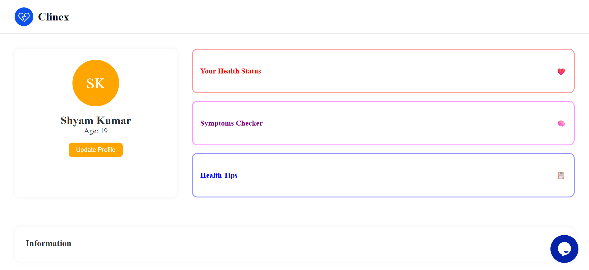
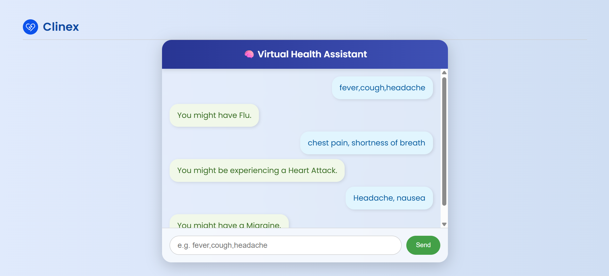

# 🤖 Clinex - Your AI-Powered Personal Health Assistant

Clinex is an AI-enabled health assistant web application designed to provide users with instant medical guidance based on their symptoms. It aims to bridge the accessibility gap in early diagnosis using a simple interface, secure authentication, and AI-driven decision-making.

---

## 🚀 Overview

Clinex empowers users to:
- Input symptoms through a user-friendly interface.
- Instantly get recommendations using predefined logic and AI inference.
- Securely register and manage their profile.
- Access future AI-based chatbot support and teleconsultation (under development).

---

## 🧩 Features

- 🔐 **Authentication**: Secure sign-up and login with Firebase Authentication.
- 📋 **Health Assistant Dashboard**: A clean dashboard where users input symptoms and get results.
- 🧠 **AI Recommendation System**: Matches symptoms with common health conditions (currently rules-based with GPT integration planned).
- 📈 **Expandable Architecture**: Scalable and modular for future AI chatbot, report downloads, and live consults.

---

## 🌐 Tech Stack

| Layer         | Technology                       |
|---------------|----------------------------------|
| Frontend      | HTML, CSS, JavaScript            |
| Backend       | Node.js, Express.js              |
| Authentication| Firebase Authentication          |
| Database      | MongoDB (for user profile data)  |
| AI Logic      | Rules-based matching (GPT planned) |

---

## 🏗️ Architecture

```
+----------------+        +----------------+        +----------------+
|                |        |                |        |                |
|   React.js     | <----> |   Node.js      | <----> |    MongoDB     |
|  (Frontend)    |        |   (Backend)    |        |  (Database)    |
|                |        |                |        |                |
+----------------+        +----------------+        +----------------+
        |                 
        |                         
        v                         
+----------------+
|                |
| Firebase Auth  |
| (Security)     |
|                |
+----------------+

QR Code Generation & One-Time Access Flow Integrated
```

---

## ⚙️ Installation

1. Clone the repository:

```bash
git clone https://github.com/shyam242/Clinex/
cd Clinex
```
(Open MongoDB compass)

2. Install dependencies for server and client:

```bash
npm install
npm install express mongoose cors
cd backend
node server.js
```

3. Configure Firebase
Create a firebase.js file and add your Firebase configuration:

4. Run the server
node backend/server.js
--- 

## 🖼️ Screenshots

| Clinex         | Symptoms Details      |
|----------------------|----------------------|
|  |  

| Dashboard   | Assistant  |
|----------------------|----------------------|
|  |  |

---

## Demo Video##
https://drive.google.com/file/d/1hToKGKZbArnKN-PQPdvcvCVDqnDqjDzm/view?usp=drive_link

---

## 🚀 Future scope
- **Data Privacy and Security**

Plan to implement HIPAA-compliant measures

- **Cross-Device Monitoring**

Integration with wearable health devices

- **Telemedicine Integration**

Direct video consultations with verified professionals

- **Multi-Language Support**

---

  ## ⚠️ Prototype Limitations

- Currently, Prototype assistant has limited dataset.
- Due to time constraints, state handling of the user has error in implementation.
- A key future goal is to increase the dataset of the AI assistant.

---

## 👥 Contributors

- **Team Name:** Learners  
- **Members:**  
  - Shyam Kumar(Leader)
  - Soham Nag

---

## 📄 License

This project is licensed under the **MIT License**. See the [LICENSE](LICENSE) file for details.

---

*Made with ❤️ for good health of every individual*


